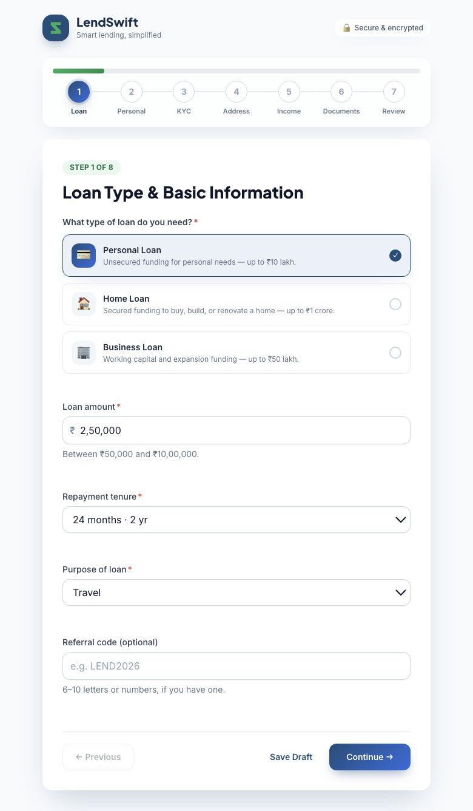
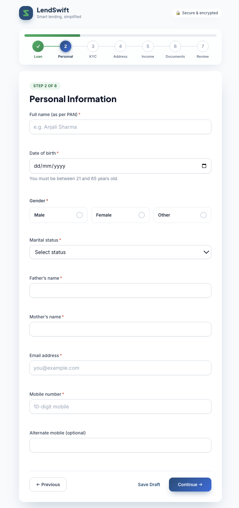
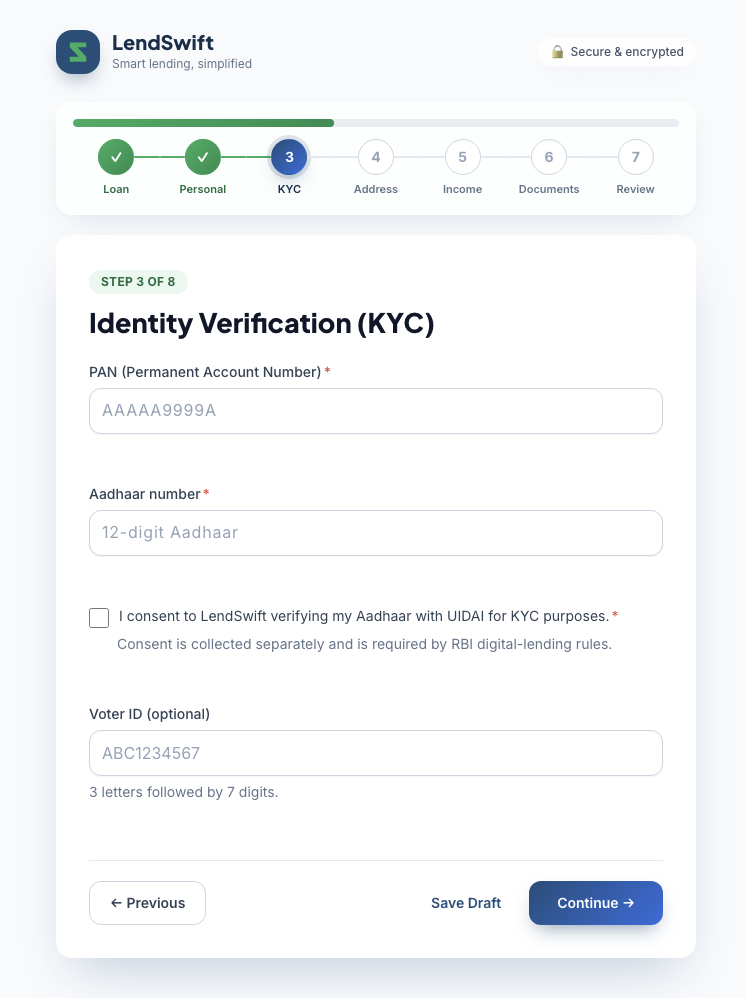
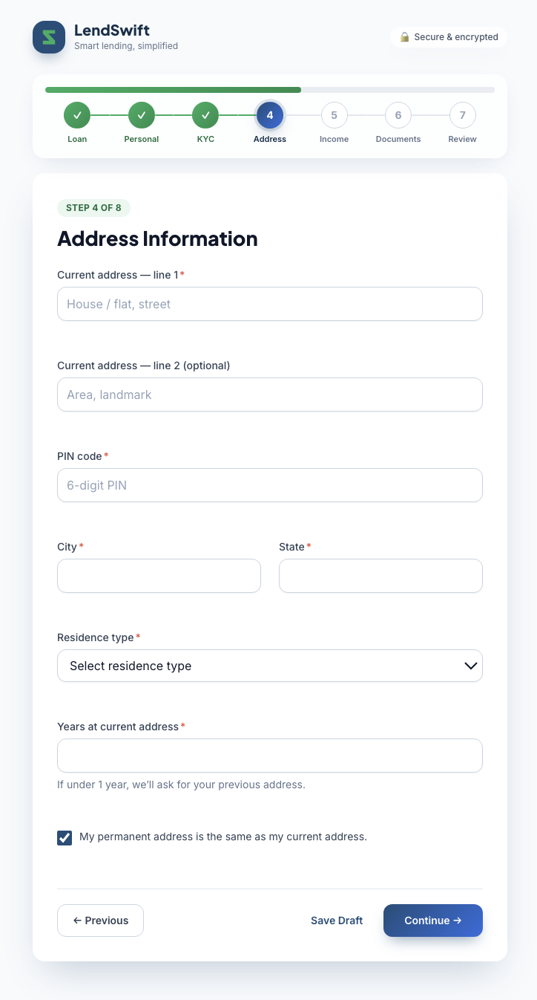
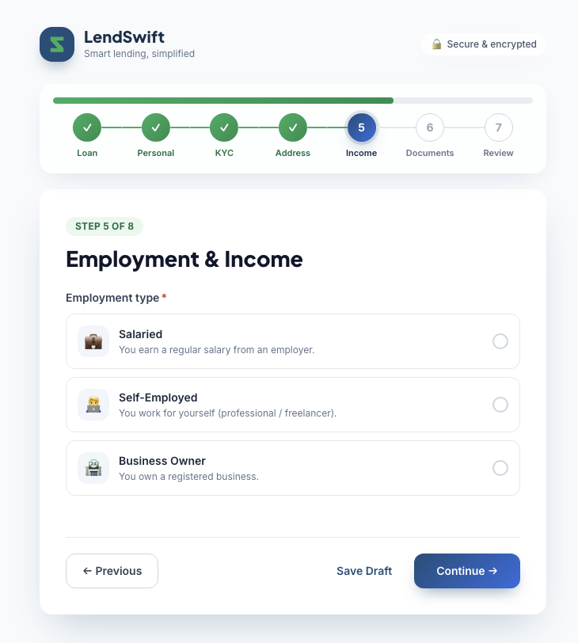
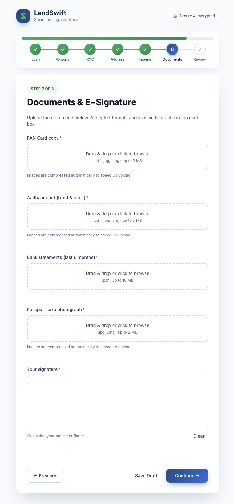
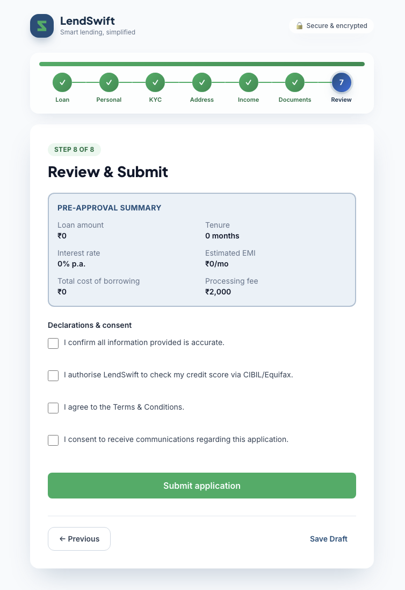
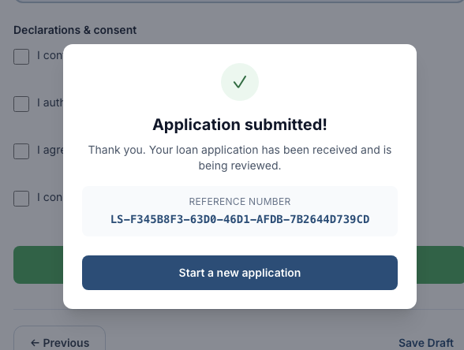
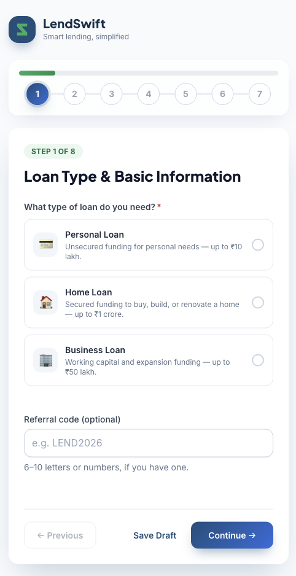

# LendSwift — Multi-Step Loan Application Form

A production-grade, **8-step** loan application form for **Personal**, **Home**, and
**Business** loans, built for the LendSwift digital-lending simulation. It features
real-time + cross-step validation, conditional field/step rendering, document upload
with client-side compression, e-signature capture, AES-256-GCM encrypted
auto-save/resume, and a pre-approval (Key Fact Statement) summary with EMI
calculation.

**🔗 Live demo:** https://zethetaproject1.netlify.app/

## Screenshots

| | |
| --- | --- |
| **Step 1 — Loan type**<br> | **Step 2 — Personal**<br> |
| **Step 3 — KYC**<br> | **Step 4 — Address**<br> |
| **Step 5 — Employment**<br> | **Step 6 — Co-applicant**<br> |
| **Step 7 — Documents**<br> | **Submitted ✓**<br> |
| **Mobile (responsive)**<br> | |

## Tech stack

| Concern | Choice |
| --- | --- |
| UI | React 18 + Vite (JavaScript + JSDoc) |
| Form state | React Hook Form |
| Validation | Zod (schema-based, cross-step dependencies) |
| Wizard / navigation state | Zustand |
| Styling | Tailwind CSS |
| File upload | React Dropzone + Canvas-API compression |
| E-signature | react-signature-canvas |
| E2E tests | Cypress (+ cypress-axe) |
| Unit tests | Vitest + Testing Library |
| Linting | ESLint (Airbnb + jsx-a11y) |

## Getting started

```bash
npm install        # install dependencies
npm run dev        # dev server  -> http://localhost:5173
npm run build      # production build
npm run preview    # preview the production build
npm run lint       # ESLint (Airbnb) — error-free
npm run test:unit  # Vitest unit/integration tests
npm run test:e2e   # Cypress E2E suite (needs the app running, see below)
```

### Running the E2E suite

```bash
# terminal 1
npm run preview -- --port 5173
# terminal 2
npm run test:e2e            # headless, all specs
npm run test:e2e:open      # interactive runner
```

## Features (mapped to the brief)

- **8 steps**: Loan type → Personal → KYC → Address → Employment → Co-applicant
  (conditional) → Documents → Review.
- **Real-time validation** on blur (Nielsen principle: inline, post-blur), with
  schema-based rules per step (Zod) and **14 cross-step dependencies** (e.g. DOB
  caps loan tenure to age 65; employment type drives required documents; loan
  amount/type controls the co-applicant step).
- **PAN** format + entity-type rules and **Aadhaar Verhoeff checksum**, with a
  simulated 1.5s verification.
- **PIN-code lookup** auto-fills city/state from a bundled dataset covering all 28
  states + 8 UTs.
- **Document upload** with drag-and-drop, type/size validation, **Canvas image
  compression**, and preview.
- **E-signature** canvas (responsive, base64 PNG, screen-capture overlay on blur).
- **AES-256-GCM encrypted auto-save** to LocalStorage (debounced; 72h TTL;
  schema-version + tamper checks) with a **resume-or-start-fresh** modal.
- **Pre-approval summary**: indicative rate, EMI (reducing-balance formula), total
  cost of borrowing, processing fee — all in the Indian number system — plus an
  EMI-to-income affordability check and four granular RBI-style consents.
- **Accessibility (WCAG 2.1 AA)**: labelled inputs, `aria-live` error regions,
  focus moved to the step heading on transition, keyboard operable, 44×44px touch
  targets, AA colour contrast. An axe-core spec audits every step.
- **Performance**: step components are lazy-loaded; main chunk ≈ 83 KB gzipped
  (target < 300 KB).

## Architecture

The form uses the **Wizard + Step Registry** pattern. A single React Hook Form
instance is the source of truth for field values; a small Zustand store holds
navigation state (current step, visited steps, submission ref). Navigation is keyed
by **stable step identifiers** (not array indices), so the conditional co-applicant
step can appear/disappear without corrupting the user's position. A `schemaFactory`
returns the Zod schema for the active step (constructed from the full form values so
cross-step rules can be expressed). Full write-up: [ARCHITECTURE.md](ARCHITECTURE.md).

## Project structure

```
src/
  components/
    common/    Input (compound), Select, RadioGroup, Checkbox, CurrencyInput,
               MaskedInput, ErrorMessage, FileUpload, SignatureCanvas
    steps/     Step1LoanType … Step8Review
    wizard/    Wizard, ProgressBar, StepNavigation, ResumeModal, AutoSaveToast, SuccessModal
  hooks/       useVerification, usePinCodeLookup, useAutoSave, useFormPersistence
  schemas/     step1…step8 schemas + schemaFactory
  utils/       validators (PAN/Aadhaar/Verhoeff), indianFormat, emiCalculator,
               imageCompression, encryption, draftStorage
  constants/   loanProducts, steps, documents, defaultFormValues
cypress/
  e2e/         16 journey specs    support/  commands + cypress-axe   fixtures/  data + sample files
```

## Testing

- **Unit/integration (Vitest):** 50 tests across validators (incl. Verhoeff vs
  reference vectors), EMI math, Indian formatting, encryption round-trip + tamper,
  draft persistence, schemas, cross-step map, and a Wizard integration test.
- **E2E (Cypress):** 16 journeys — 3 loan-type happy paths, per-step validation,
  PIN lookup, employment switching, conditional co-applicant, upload + compression,
  e-signature, auto-save/resume, keyboard operation, rapid-navigation stress,
  cross-step dependency updates, and an axe-core accessibility audit.

## Known limitations

- **Browser Back/Forward** is not wired to step navigation (the wizard does not push
  history entries); use the in-app Previous/Continue and progress-bar controls.
- Uploaded files are **not** included in the encrypted auto-save (size/quota); other
  fields are. Files are re-supplied on resume.
- The Cypress suite must be run on a machine where the Cypress Electron runner can
  launch (it could not start in the original CI sandbox); the specs themselves are
  written against the real DOM and lint clean.

## Deployment

Deployed on Netlify: **https://zethetaproject1.netlify.app/**

This is a static SPA (no backend, no client-side routing). Deploy the `dist/` build
to any static host:

- **Netlify**: config in [netlify.toml](netlify.toml) (`npm run build`, publish `dist`).
- **Vercel**: auto-detects Vite (build `npm run build`, output `dist`).

## License / confidentiality

All work is the property of Zetheta Algorithms Private Limited and is strictly
private and confidential. See [SUBMISSION.md](SUBMISSION.md) for the submission and
repository-transfer protocol.
